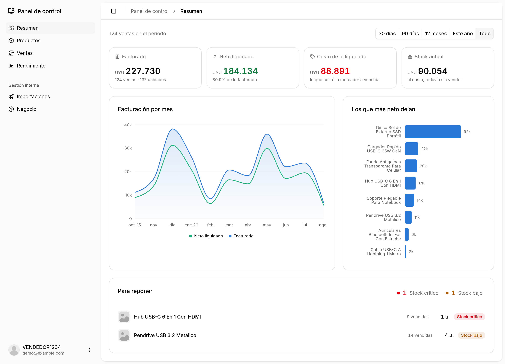
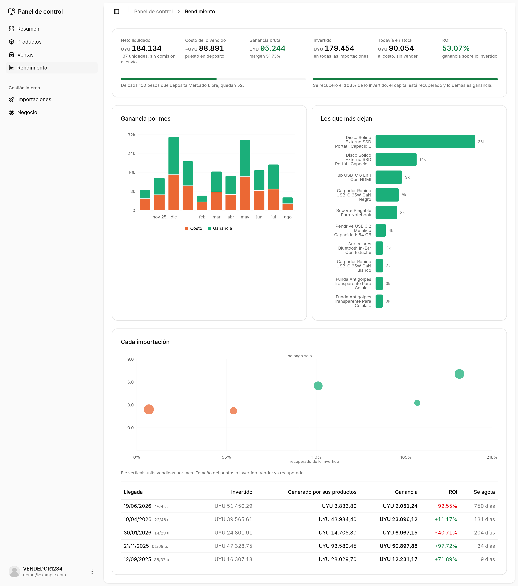
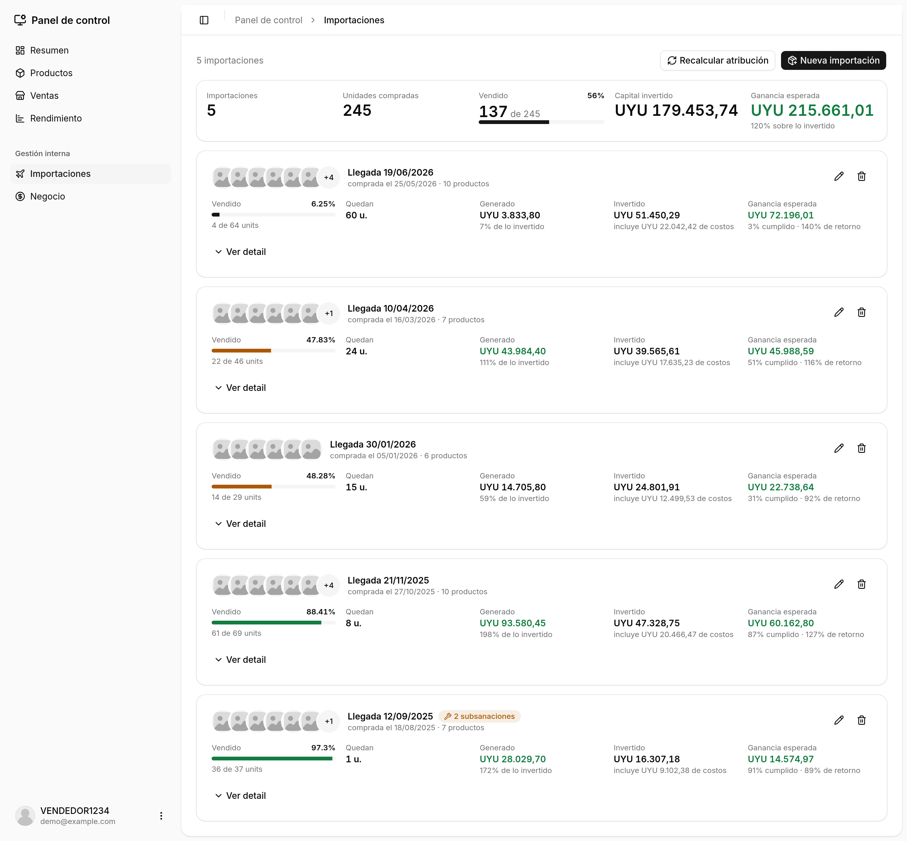
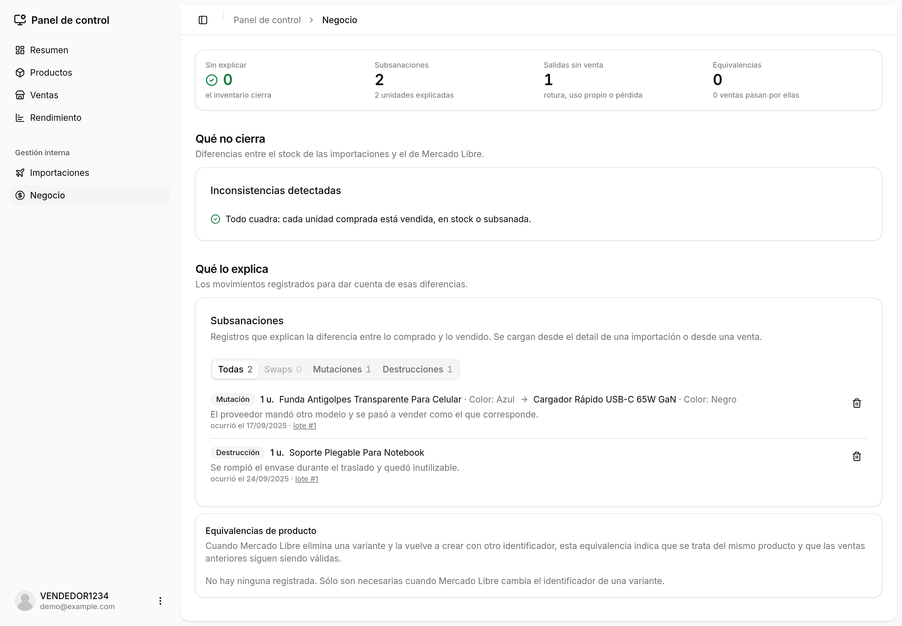

# MH — Rentabilidad real para un vendedor de Mercado Libre

[](https://github.com/jsevzq/ml-sys/actions/workflows/ci.yml)
[](LICENSE)
[](.nvmrc)

Sistema de gestión para un vendedor de Mercado Libre que **importa** la mercadería que vende. Sincroniza el catálogo y las ventas desde la API de Mercado Libre, registra cada importación con su costo real puesto en depósito y atribuye cada venta a un lote por FIFO, para responder la pregunta que la plataforma no responde: **cuánto se ganó**.



---

## El problema

Mercado Libre te dice cuánto **facturaste**. No cuánto **ganaste**, porque no puede: no sabe lo que te costó la mercadería.

Y no alcanza con restar un costo promedio, porque nada de esto es constante:

- **La comisión** es un porcentaje del precio **más un cargo fijo** que desaparece por encima de cierto monto.
- **El envío** a veces lo paga el vendedor, a veces el comprador, a veces se comparte entre varias ventas del mismo carrito. Con Mercado Envíos Flex el vendedor lo **cobra** en vez de pagarlo.
- **El costo de una unidad** depende de en qué importación llegó: mismo producto, tres lotes, tres precios y tres tipos de cambio, con el flete y el despacho prorrateados encima.

El número que importa vive en el cruce de esas dos puntas, y no hay ninguna pantalla que lo muestre. Este sistema es esa pantalla.

## Qué hace

| | |
|---|---|
| **Sincroniza** | Catálogo y ventas desde la API de Mercado Libre, con OAuth y refresco silencioso de tokens. El catálogo es un espejo de sólo lectura: la fuente de verdad es la plataforma. |
| **Liquida** | Calcula lo que Mercado Libre efectivamente deposita por cada venta: comisión por unidad, envío según logística, prorrateo entre ventas hermanas, cancelaciones. |
| **Cuesta** | Costo puesto en depósito de cada importación: mercadería, más flete, despachante y régimen aduanero prorrateados por valor. |
| **Atribuye** | Reparte cada venta al lote que la abasteció, por FIFO, con una línea de tiempo que respeta las fechas de llegada. |
| **Reconcilia** | Detecta cuando el inventario no cierra y permite explicarlo: unidades rotas, productos que llegaron siendo otro, envíos cambiados a pedido del comprador. |
| **Proyecta** | Estima al cargar cada lote cuánto va a dejar una vez vendido, para poder comparar después contra lo que realmente pasó. |

### Rendimiento

Margen, ROI y velocidad de venta por lote, por producto y por mes. La línea punteada marca el 100 % de lo invertido: a la derecha están los lotes que ya se pagaron solos.



### Importaciones

Cada lote con su costo real, su avance de venta y su ganancia esperada.



### Reconciliación

Cuando el stock que dicen los lotes no coincide con el de Mercado Libre, el detector lo marca. Cada diferencia se explica con una subsanación, y el objetivo es dejar el contador en cero.



---

## Stack

**Backend** · NestJS 11 · TypeORM 0.3 · PostgreSQL 16 · JWT · Swagger · Jest
**Frontend** · React 19 · Vite · TypeScript · TanStack Query · Zustand · shadcn/ui · Tailwind · Recharts · Orval · Vitest

## Cómo correrlo

Hace falta Node 22 y Docker. **No hacen falta credenciales de Mercado Libre**: el seed carga datos de demostración.

```bash
git clone https://github.com/jsevzq/ml-sys.git && cd ml-sys

# 1 · Backend
cd backend
cp .env.example .env          # completar DB_PASSWORD y JWT_SECRET
docker compose up -d          # Postgres 16 en el puerto 2345
npm ci
npm run migration:run
npm run seed:demo             # catálogo, 5 importaciones y ~125 ventas ficticias
npm run start:dev             # http://localhost:3000 · Swagger en /api

# 2 · Frontend (otra terminal)
cd ../frontend
npm ci
npm run dev                   # http://localhost:5173
```

Entrar con **`demo@example.com`** / **`demo1234`**.

El cliente de la API está versionado, así que no hace falta regenerarlo. Si se toca el backend: `npm run generate:api` con el backend levantado.

## Arquitectura

```
backend/                     NestJS · 7 módulos · 18 entidades
  src/
    auth/                    JWT, guard global con escape @Public()
    ml/                      OAuth, sincronización, guard de cuenta vinculada
    ml-client/               Cliente HTTP de la API de Mercado Libre
    items/                   Catálogo (espejo de sólo lectura)
    orders/                  Ventas, envíos y reglas de liquidación
    importations/            Lotes, costos, atribución FIFO, subsanaciones y rentabilidad
  migrations/                Esquema versionado

frontend/                    React · 8 features · 13 páginas
  src/
    features/<dominio>/      api/ + components/ + lib/ — cada feature exporta su índice
    api/generated/           Cliente y tipos generados por Orval
    components/ui/           shadcn
```

La lógica que decide plata vive en módulos puros dentro de `lib/`, sin dependencias del framework: liquidación de Mercado Libre, costo puesto en depósito, atribución FIFO, valor esperado y equivalencias de SKU.

## Tests

**200 tests**: 140 en el backend (Jest) y 60 en el frontend (Vitest).

```bash
cd backend  && npm test
cd frontend && npm test
```

La mayoría cubre esos módulos puros. Los de liquidación y valor esperado son *golden tests*: comparan el cálculo contra importes que Mercado Libre efectivamente cobró.

## Alcance

Proyecto personal, en uso real para gestionar un negocio de importación.

- **El OAuth de Mercado Libre necesita un dominio público.** La aplicación registrada en el devcenter exige una `redirect_uri` que resuelva; sin dominio, la vinculación se completa pegando a mano la URL de retorno. Por lo mismo no hay webhooks y la sincronización es a pedido.
- **Sin despliegue.** Corre en local contra Postgres en Docker.

## Licencia

[MIT](LICENSE).
